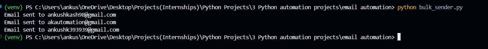
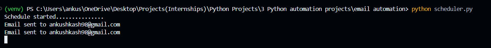
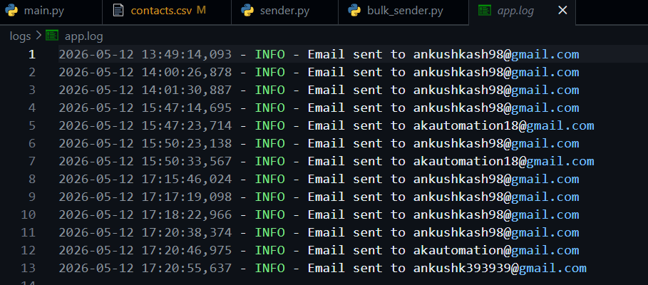

# Email Automation System

A Python-based automation system for sending:
- single emails
- bulk emails
- scheduled reminders

## Features

- SMTP email sending
- HTML email templates
- Bulk email automation
- CSV-based recipient management
- Retry logic
- Logging system
- Attachment support
- Scheduled email sending

## Tech Stack

- Python
- SMTP
- pandas
- python-dotenv
- schedule
- logging

## Project Structure

```bash
email_automation/
```

## Installation

```bash
pip install -r requirements.txt
```

## Run Bulk Email System

```bash
python bulk_sender.py
```

## Run Scheduler

```bash
python scheduler.py
```

## Security

Environment variables are stored using `.env`.


## Screenshots

### Bulk Email Sender



---

### Scheduler Email Preview



---

### Logging System



---

